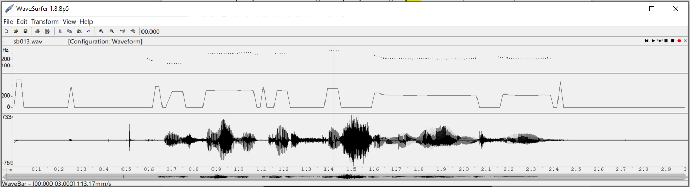
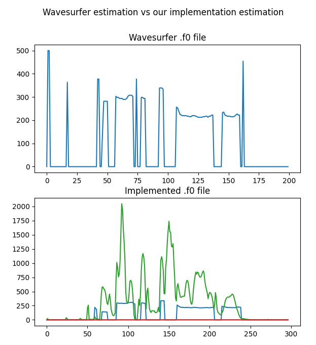
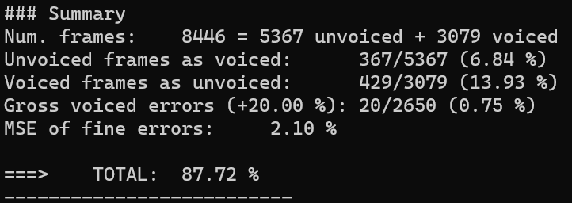

PAV - P3: detección de pitch
============================

Esta práctica se distribuye a través del repositorio GitHub [Práctica 3](https://github.com/albino-pav/P3).
Siga las instrucciones de la [Práctica 2](https://github.com/albino-pav/P2) para realizar un `fork` de la
misma y distribuir copias locales (*clones*) del mismo a los distintos integrantes del grupo de prácticas.

Recuerde realizar el *pull request* al repositorio original una vez completada la práctica.

Ejercicios básicos
------------------

- Complete el código de los ficheros necesarios para realizar la detección de pitch usando el programa
  `get_pitch`.

   * Complete el cálculo de la autocorrelación e inserte a continuación el código correspondiente.
   
    ```c++
    for (unsigned int l = 0; l < r.size(); ++l) {
      r[l] = 0;
      for (unsigned int n = l; n < x.size(); ++n) {
        r[l] += x[n]*x[n-l];
      }
    }
    ```

   * Inserte una gŕafica donde, en un *subplot*, se vea con claridad la señal temporal de un segmento de unos 30 ms de un fonema sonoro y su periodo de pitch; y, en otro *subplot*, se vea con claridad la autocorrelación de la señal y la posición del primer máximo secundario.

	 NOTA: es más que probable que tenga que usar Python, Octave/MATLAB u otro programa semejante para hacerlo. Se valorará la utilización de la librería matplotlib de Python.

   

   * Determine el mejor candidato para el periodo de pitch localizando el primer máximo secundario de la
     autocorrelación. Inserte a continuación el código correspondiente.
     
    ```c++
    for (iR = r.begin() + npitch_min; iR < r.begin() + npitch_max; iR++) {
      if (*iR > *iRMax) {
        iRMax = iR;
      }
    }
    ```

   * Implemente la regla de decisión sonoro o sordo e inserte el código correspondiente.

   ```c++
   bool PitchAnalyzer::unvoiced(float pot, float r1norm, float rmaxnorm) const {
    return (pot < this->pth && rmaxnorm < this->dth);
   }
   ```

- Una vez completados los puntos anteriores, dispondrá de una primera versión del detector de pitch. El 
  resto del trabajo consiste, básicamente, en obtener las mejores prestaciones posibles con él.

  * Utilice el programa `wavesurfer` para analizar las condiciones apropiadas para determinar si un
    segmento es sonoro o sordo. 
	
	  - Inserte una gráfica con la detección de pitch incorporada a `wavesurfer` y, junto a ella, los 
	    principales candidatos para determinar la sonoridad de la voz: el nivel de potencia de la señal
		(r[0]), la autocorrelación normalizada de uno (r1norm = r[1] / r[0]) y el valor de la
		autocorrelación en su máximo secundario (rmaxnorm = r[lag] / r[0]).

    Para poder visualizar los datos requeridos con `wavesurfer`, hemos editado pitch_analyzer.cpp para que nos dé como output un fichero con los valores de potencia, autocorrelación normalizada de uno y autocorrelación en su máximo secundario. 
    
    

    Después hemos recortado este fichero para obtener 3 ficheros distintos, cada uno con los datos correspondientes: 
     

    Por último lo hemos visualizado con `wavesurfer`. De arriba a abajo se encuentran los gráficos correspondientes a: potencia de la señal,  autocorrelación normalizada de uno, autocorrelación en su máximo secundario y por último, la señal en questión. 

   

  Podemos ver que los tramos sonoros presentan ratios de autocorrelación cercanos a 1, mientras en el tramos sordos, estas ratios tienden a 0. Respecto a la potencia, esta también aumenta en tramos sonoros respecto a los tramos sordos. 

		Puede considerar, también, la conveniencia de usar la tasa de cruces por cero.

    Tal y como hemos visto en teoría, la tasa de cruces por 0 es más elevada en tramos sordos que sonoros, sin embargo, no hemos implementado esta modalidad en nuestro detector. 

	    Recuerde configurar los paneles de datos para que el desplazamiento de ventana sea el adecuado, que
		en esta práctica es de 15 ms.

      - Use el detector de pitch implementado en el programa `wavesurfer` en una señal de prueba y compare
	    su resultado con el obtenido por la mejor versión de su propio sistema.  Inserte una gráfica
		ilustrativa del resultado de ambos detectores.

  

  En la imagen podemos ver, de arriba a abajo: la detección de pitch propuesta por wavesurfer, la detección de pitch de nuestro detector y por último la señal en questión. Nuestro detector estima bastante bien qué tramos son sordos y qué tramos sonoros, aunque a veces detecta tramos sonoros que wavesurfer analiza como tramos sordos sin pitch.
  
  * Optimice los parámetros de su sistema de detección de pitch e inserte una tabla con las tasas de error
    y el *score* TOTAL proporcionados por `pitch_evaluate` en la evaluación de la base de datos 
	`pitch_db/train`.

  Esta tabla corresponde a los resultados obtenidos con la implementación del ejercicio básico, y no contempla las mejoras propuestas en la ampliación.

    **Apartado**                   |**Valor**              
    -------------------------------| :----------------------------------: 
    Number of frames               |8446 = 5367 unvoiced + 3079 voiced                       
    Unvoiced frames as voiced      |337/5367 (6.28 %)                     
    Voiced frames as unvoiced:     |445/3079 (14.45 %)
    Gross voiced errors (+20.00 %) |17/2634 (0.65 %)
    MSE of fine errors             |2.06 %
    TOTAL                          |87.92 %

Esta segunda tabla corresponde a las mejoras obtenidas gracias a la implementación de la ventana rectangular y el método de preprocesado Center Clipping: 

  **Apartado**                   |**Valor**              
  -------------------------------| :----------------------------------: 
   Number of frames               |8446 = 5367 unvoiced + 3079 voiced                       
   Unvoiced frames as voiced      |325/5367 (6.28 %)                     
   Voiced frames as unvoiced:     |445/3079 (14.45 %)
   Gross voiced errors (+20.00 %) |17/2634 (0.65 %)
   MSE of fine errors             |2.06 %
   TOTAL                          |88.06 %

   * Inserte una gráfica en la que se vea con claridad el resultado de su detector de pitch junto al del
     detector de Wavesurfer. Aunque puede usarse Wavesurfer para obtener la representación, se valorará
	 el uso de alternativas de mayor calidad (particularmente Python).

      
   

Ejercicios de ampliación
------------------------

- Usando la librería `docopt_cpp`, modifique el fichero `get_pitch.cpp` para incorporar los parámetros del
  detector a los argumentos de la línea de comandos.
  
  Esta técnica le resultará especialmente útil para optimizar los parámetros del detector. Recuerde que
  una parte importante de la evaluación recaerá en el resultado obtenido en la detección de pitch en la
  base de datos.

  * Inserte un *pantallazo* en el que se vea el mensaje de ayuda del programa y un ejemplo de utilización
    con los argumentos añadidos.

    

    Tenemos 3 parámetros correspondientes a thresholds para la potencia, r[1]/r[0] y r[lag]/r[0]. De estos, sólo el primero y el último se usan para detectar la sonoridad, el segundo se ha implementado para provar los valores óptimos y realizar futuras pruebas. En *default* tenemos los valores óptimos, de manera que si el programa se ejecuta sin argumentos, va a dar el mejor resultado.

    Como ejemplo, vamos a hacer una prueba con valores distintos a los óptimos, con el objetivo de comprobar el correcto funcionamiento de las opciones.

    

    

    Vemos cómo usando un threshold de potencia de -3 dB y uno para r[lag]/r[0] de 0.2 obtenemos una puntuación total dos décimas menor en tanto por ciento.

- Implemente las técnicas que considere oportunas para optimizar las prestaciones del sistema de detección
  de pitch.

  Entre las posibles mejoras, puede escoger una o más de las siguientes:

  * Técnicas de preprocesado: filtrado paso bajo, *center clipping*, etc.
  * Técnicas de postprocesado: filtro de mediana, *dynamic time warping*, etc.
  * Métodos alternativos a la autocorrelación: procesado cepstral, *average magnitude difference function*
    (AMDF), etc.
  * Optimización **demostrable** de los parámetros que gobiernan el detector, en concreto, de los que
    gobiernan la decisión sonoro/sordo.

    Para optimizar los parámetros hemos usado los scripts `optimize_vad.sh` y `getBestParameters.m`, aprovechando buena parte de ellos de la práctica anterior. El primer script ejecuta varias veces `get_pitch` y `pitch_evaluate` para distintos valores de los 3 thresholds comentados anteriormente, y pasa el resultado de la evaluación a un fichero. Despúes, ejecutando el segundo script, obtenemos el fichero `testresults.txt`, dónde se almacenan los valores máximos obtenidos y los parámetros que los han logrado. 

    La optimización consiste en ir cambiando la regla de decisión de sonoridad en `get_pitch`, e ir ampliando o reduciendo el rango de valores de los thresholds para los que se ejecuta el programa con tal de ir acercándonos al valor óptimo. El fichero donde se guardan los distintos máximos para cada configuración del detector de sonoridad no se sobreescribe, con tal de poder usar las distintas pruebas como referencia, también a modo de memoria.

    Hemos implementado el center clipping de forma no biyectiva, sin utilizar offsets, ya que hemos encontrado que daba mejores resultados. Para encontrar el valor óptimo, hemos usado los scripts mencionados. El código queda de la siguiente forma: 

      

  * Cualquier otra técnica que se le pueda ocurrir o encuentre en la literatura.

  Encontrará más información acerca de estas técnicas en las [Transparencias del Curso](https://atenea.upc.edu/pluginfile.php/2908770/mod_resource/content/3/2b_PS%20Techniques.pdf)
  y en [Spoken Language Processing](https://discovery.upc.edu/iii/encore/record/C__Rb1233593?lang=cat).
  También encontrará más información en los anexos del enunciado de esta práctica.

  Incluya, a continuación, una explicación de las técnicas incorporadas al detector. Se valorará la
  inclusión de gráficas, tablas, código o cualquier otra cosa que ayude a comprender el trabajo realizado.

  También se valorará la realización de un estudio de los parámetros involucrados. Por ejemplo, si se opta
  por implementar el filtro de mediana, se valorará el análisis de los resultados obtenidos en función de
  la longitud del filtro.
   

Evaluación *ciega* del detector
-------------------------------

Antes de realizar el *pull request* debe asegurarse de que su repositorio contiene los ficheros necesarios
para compilar los programas correctamente ejecutando `make release`.

Con los ejecutables construidos de esta manera, los profesores de la asignatura procederán a evaluar el
detector con la parte de test de la base de datos (desconocida para los alumnos). Una parte importante de
la nota de la práctica recaerá en el resultado de esta evaluación.
